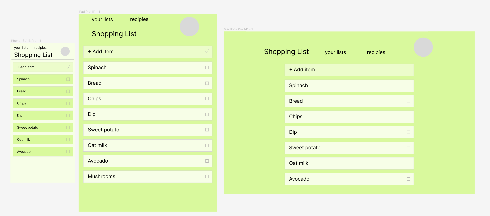
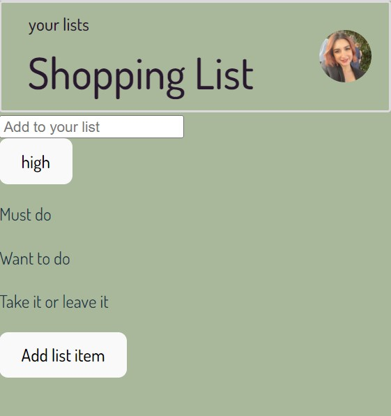
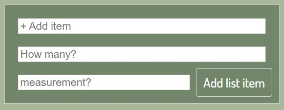
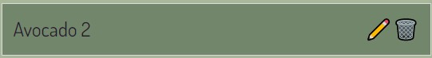

# Project-3 -- List It

## Description:

This is not just any shopping list, this shopping list is also a MERN PWA and is downloadable to your mobile and computer devices. This application is fast, reliable, and works offline. Dynamic frontend created with React.
// COME BACK TO THIS AND WRITE MORE!

## User Setup: // need to udpate!

To use this at home, in your terminal run the following commands to invoke the application:
`npm i` to install packages,
then `npm run start` starts the live server.

## User Story

```md
with PWA:
AS A shopper
I WANT to create a shopping list that I can share with others with or without an internet connection
SO THAT I can reliably retrieve for later use at the supermarket

without PWA:
AS A shopper
I WANT to create a shopping list that I can edit and share with others
SO THAT I can retrieve for later use at the supermarket
```

(Possible PWA support https://www.npmjs.com/package/vite-plugin-pwa )

## Screenshots:



## Technologies used:

Vite for React, HTML, CSS, Styled-Components, Babel-plugin-styled-components,

## Links:

- GitHub: https://github.com/NessJade96/Project-3
- Heroku:

## planning notes:

1. Go through the criteria

- Create wireframe concept of mobile, tablet, and desktop.
  -media queries: Mobile 320px - 480px, Tablet 481px - 1024px, PC 1025+px
- Create user login/signup page or model
  - link this to user signup (mutations/querires)
- Setup React, src code etc. Client and Server
- Set up configs for PWA's (using Babel and Webpack) (Will do after MVP)

Colorpallet from Coolors:

- Dark Purple: 41, 25, 46 RGB
- Burnished Brown: 139, 112, 113 RBG
- Xanadu: 114, 134, 107 RGB
- Laurel Green: 169, 183, 155 RGB
- Gainsboro: 221, 218, 222 RBG
  

## Commit notes:

1. Write my planning notes, folder setup, and create readme.md

2. Create React DOM to render the mobile screen.

3. React rendering and components first render.

4. Installed Styled-Components and the Babel-plugin-styled-components, to use for the applications styling. I read the docs and created a globalStyles.js for my background colour and text fonts etc.

5. Created styling for the NAV using sytled-components.
   

6. Made simple styling (pending some cleaning up) on the GroceryItemForm.
   

7. Styling of the grocery list items.
   

8. Changed the website icon, and other icons throughout the website.

9. Added in media queries for list page, added the login/logout button (no functions yet as I need to create the server).

10. Renamed each of the text/value variables so they are consistent like the amount and measurements variables.

Thank you, Vanessa Bloom <(^.^)>

[Good link on deploying to github pages while using Vite](https://dev.to/shashannkbawa/deploying-vite-app-to-github-pages-3ane)
