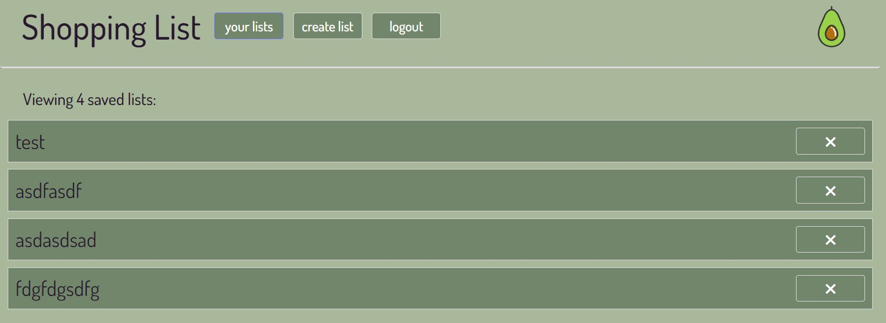

# List It

## Description:

-With PWA
This is not just any shopping list, this shopping list is also a MERN PWA and is downloadable to your mobile and computer devices. This application is fast, reliable, and works offline. This is a dynamic application created with Mongodb, Express, React, and Node.

-Without PWA
This shopping list application is a dynamic application created with Mongodb, Express, React, and Node. The user is able to create an account, and access their saved shopping lists from anywhere!

## User Setup: // need to udpate!

To use this at home, in the root folder, run in your terminal the following commands to invoke the application:
`npm i` to install packages,
then `npm run develop` starts the live servers.

## User Story

```md
with PWA:
AS A shopper
I WANT to create a shopping list that I can share with others with or without an internet connection
SO THAT I can reliably retrieve for later use at the supermarket

without PWA:
AS A shopper
I WANT to create a shopping list that I can edit and share with others
SO THAT I can retrieve for later use at the supermarket
```

(Possible PWA support https://www.npmjs.com/package/vite-plugin-pwa )

## Screenshots:


## Technologies used:

Vite for React, HTML, CSS, Styled-Components, Babel-plugin-styled-components, Apollo, GraphQL, bcrypt, express, JWT, mongoose, nodemon, react-dom, react-router-dom, Vite,

## Links:

- GitHub: https://github.com/NessJade96/Project-3
- Heroku: https://blooming-basin-11579.herokuapp.com/

## planning notes:

1. Go through the criteria

- Create wireframe concept of mobile, tablet, and desktop.
  -media queries: Mobile 320px - 480px, Tablet 481px - 1024px, PC 1025+px
- Create user login/signup page or model
  - link this to user signup (mutations/queries)
- Setup React, src code etc. Client and Server
  - Create Users and grocery item lists in database.
- Set up configs for PWA's (using Babel and Webpack) (Will do after MVP)

Colorpallet from Coolors:

- Dark Purple: 41, 25, 46 RGB
- Burnished Brown: 139, 112, 113 RBG
- Xanadu: 114, 134, 107 RGB
- Laurel Green: 169, 183, 155 RGB
- Gainsboro: 221, 218, 222 RBG
  

## Commit notes:

1. Write my planning notes, folder setup, and create readme.md

2. Create React DOM to render the mobile screen.

3. React rendering and components first render.

4. Installed Styled-Components and the Babel-plugin-styled-components, to use for the applications styling. I read the docs and created a globalStyles.js for my background colour and text fonts etc.

5. Created styling for the NAV using sytled-components.
   

6. Made simple styling (pending some cleaning up) on the GroceryItemForm.
   

7. Styling of the grocery list items.
   

8. Changed the website icon, and other icons throughout the website.

9. Added in media queries for list page, added the login/logout button (no functions yet as I need to create the server).

10. Renamed each of the text/value variables so they are consistent like the amount and measurements variables.
    

11. Files and folders for the server side created.

12. Created the loginForm and SignupForm components and began styling. I have imported all main components to the App.js. I later will create functions to conditionally render each component depending if the user is logged in, etc.

13. Imported the apollo client, auth, and react-router-dom. Implimented the functions for auth, and updated the App() function with the React Router and ApolloProvider. Changed styling on H3 component. Lastly, implemented navigation between the signup page and login pages.

14. Changed the uri in App.js to 'http://localhost:3001/graphql' so the frontend calls actually reach graphql. Updated some button styling. The login and Signup user work perfectly now. You can navigate between pages smoothly. Removed the profile picture because I decided I will add that in at the end if I have time as it does not meet MVP.
    

15. Wrote queries and mutations for GET_USER, and added AddGroceryList model, updated typeDefs, resolver, and mutation. Updated the GroceryItem, and User Model. Lastly created a new more mutations in the TypeDefs for the requests to make next.

16. Made it so that the GroceryList model to has a key for users, as an array of users that have access to the list. (handle permissions on frontend)

17. The addGroceryItems resolver was created and users can now create grocery lists and add items to that list.

18. Realised I needed to refactor the collection models -> so all the queries and mutations were created again for the new models and a code tidyup was completed.

19. Working on frontend components - I created the 'create list' component so users to enter a list name and this creates a list. Additionally created the YourLists component and page so display your lists
    

20. Github continous deploy to heroku setup - site is live! When submitting your new list name, it will navigate you to 'yourlists' page on creation. When user is logged in and viewing their lists, the user can now delete the list by clicking on the cross.

21. Went through and changed the user loggedIn? navigation routes. Can now add groceryItems to the groceryList. Grocery list items now render the the screen.

Todo:
// edit listItems on groceryList page.
// Update the nav bar for logged in users info
// Update grocery lists ( add users) and update grocery items (change amounts etc.)
// Change the update / active state on the NAV bar to update "shopping list' to say 'yourlists' or the list name, or 'create list'
// work on frontend visuals
// create an input field on list page where you can add a friends username - this will add to the grocerylist array of users.
// show what users are on this list - render to the screen
// Update the mobile design (currently too small)
// Go through the readme and update information

Thank you, Vanessa Bloom <(^.^)>
